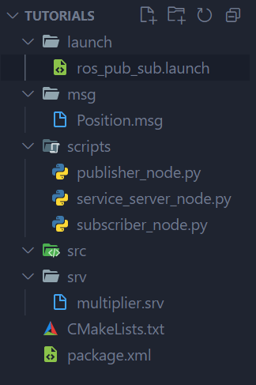

# learn how to ROS

## Roscore, Nodes, Topics, Messages
Roscore is the base server running ros

Nodes is single executable file, performs some tasks, or communicate with other nodes through services or topics

Topics is used to communicate between nodes, one way communication. Only one publisher, can have any amount of subscribers

Messages is the blueprint to describes the content sent through topics.

## linux subsystem location in windows
thisPC -> '\\wsl$' -> linux subsystem, need to have ubuntu running

## create ROS project
create workspace with subfolder src
```bash
mkdir -p workspace_name/src  # inside home
```
build project and packages inside src folder
creates devel and build folder
```bash
cd workspace_name  # inside workspace/project_name
catkin_make
```
create package
```bash
cd src  # inside src folder
catkin_create_pkg package_name rospy std_msgs  # extra dependencies for python
```
creates CMake.txt and package.xml
need to change cmake to include new nodes for compiling
```bash
cd package_name  # inside package
```
Before running any nodes need to set setup
```bash
source devel/setup.bash
```

## Python ROS folder tree


## Python Publisher
for python need to add
```python
#!/usr/bin/env
import rospy
from std_msgs.msg import String
from tutorials.msg import Position

def talk_to_me():
    pub = rospy.Publisher('talking_topic', Position, queue_size=10)  # name, type of msg, qeue size
    rospy.init_node('publisher_node', anonymous=True)  # name, have unique name
    rate = rospy.Rate(1)  # Hz
    rospy.loginfo('started publisher node')
    while not rospy.is_shutdown():
        # msg = f'Hello world {rospy.get_time()}'
        msg = Position()
        msg.message = f'my position is: '
        msg.x = 2.0
        msg.y = 1.5
        pub.publish(msg)
        rate.sleep()
    
if __name__ == '__main__':
    try:
        talk_to_me()
    except rospy.ROSInterruptException:  # for stopping app, ctrl C
        pass

# sudo chmod -R 777  your_project_directory_location  # for permission
```
In cmake, add under catkin_packages()
```bash
catkin_install_python(PROGRAMS scripts/publisher_node.py scripts/subscriber_node.py scripts/service_server_node.py
  DESTINATION ${CATKIN_PACKAGE_BIN_DESTINATION}
)
```
Compile package in workspace
```bash
catkin_make
```

## Python Subscriber
```bash
#!/usr/bin/env
import rospy
from std_msgs.msg import String
from tutorials.msg import Position

def callback(data):
    # rospy.loginfo(f'received data: {data.data}')
    rospy.loginfo(f'{data.message} x: {data.x}, y: {data.y}')
    
def listener():
    rospy.init_node('subscriber_node', anonymous=True)  # name, add number have unqiue name
    rospy.Subscriber('talking_topic', Position, callback)  # topic name, type of msg, callback func
    rospy.spin() # run node continuously until shutdown
    
if __name__ == '__main__':
    try:
        listener()
    except rospy.ROSInterruptException:  # for stopping app, ctrl C
        pass
```
In cmake, add node
```bash
catkin_install_python(PROGRAMS scripts/publisher_node.py scripts/subscriber_node.py scripts/service_server_node.py
  DESTINATION ${CATKIN_PACKAGE_BIN_DESTINATION}
)
```
Compile package in workspace
```bash
catkin_make
```

## Python Custom Message
new msg file
describes what is inside a message
```bash
string message
float32 x
float32 y
```
edit package.xml file, uncomment/add
```bash
<build_depend>message_generation</build_depend>
<exec_depend>message_runtime</exec_depend>
```
edit cmake
```bash
find_package(catkin REQUIRED COMPONENTS
  rospy
  std_msgs
  message_generation  # add this line
)
add_message_files(
  FILES
  Position.msg
)
generate_messages(
  DEPENDENCIES
  std_msgs
)
```

## Python Custom Service
new srv file
```bash
int32 a
int32 b
---
int32 result
```
```python
import rospy
from tutorials.srv import multiplier, multiplierResponse

def callback(request):
    r = request.a * request.b
    rospy.loginfo(f'{request.a} * {request.b} = {r}')
    return multiplierResponse()
    
def multiply():
    rospy.init_node('multiply_service')  # name, 
    rospy.loginfo('started service node')
    service = rospy.Service('multiplier', multiplier, callback)  # name, type of service, callback
    rospy.spin()

if __name__ == '__main__':
    multiply()
```

## ROS Launch File
new launch file
```bash
<launch>
    <node pkg='tutorials' type='publisher_node' name='pub_node' output='screen'></node>
    <node pkg='tutorials' type='subscriber_node' name='sub_node' output='screen'></node>
</launch>
```
make script files into executable
go to scripts folder
```bash
chmod +x node_name.py
```

## Running ROS
roscore and each node need to be running in its own terminal
```bash
roscore  # run ros server
source devel/setup.bash  # if running rosrun
rosrun package_name node_name.py  # rosrun node
```

## ROS commands
```bash
rostopic list  # list all running topics
rostopic echo topic_name  # prints message inside topic

rosmsg list  # list all running messges

rosservice list  # list all running services
rosservice info /service_name
rosservice call /service_name "arg arg ..."

roslaunch package_name file.launch
```
